# 📕 Implement a level-set image segmentation method using Matlab

* Implement a level-set image segmentation method to fetch the boundary of item.

* Algorithm: Geodesic Active Contour formulation of level set method (이 알고리즘에 대해 더 자세한 내용은 repository에 있는 논문 파일을 참고할 수 있음)

  <div  align="center">
      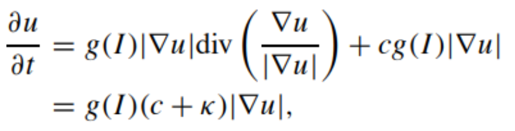
  </div><br>

### 🎈실행결과 (n = 10, 100, 200, 400)

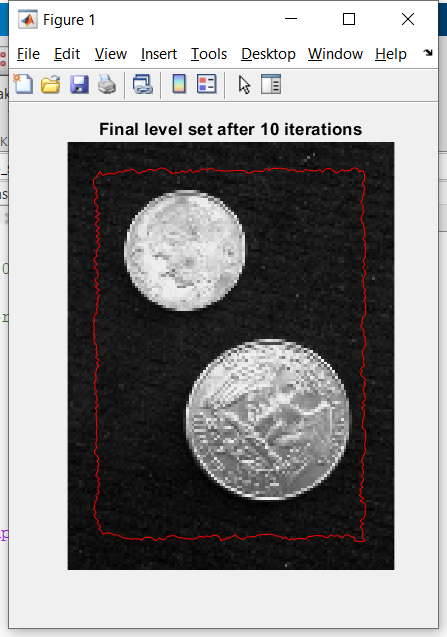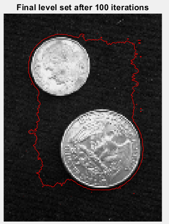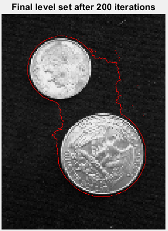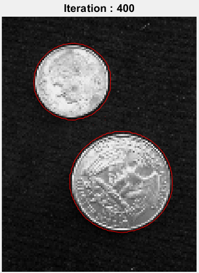


### 실행법

Repository를 Clone해서 각 함수 파일을 Matlab로 실행하면 됨.

### 📖**assign_3_skeleton**

* assign_3_skeleton에서 해야 하는 것은 g(I)를 계산하는 것입니다.

  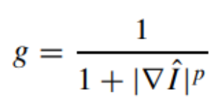

```matlab
%%%%%%%%%%%%%%%%%%%%%%%%%%%%%%%%%%%%%%%%%%%%%%%%%%%%%%%%%%%%%%%%%%%%%%%%%%%%%%%%%%%%%%%%%%%%%%%%%%%%%
% 먼저 Gaussian smoothing합니다. fspecial함수를 이용해 Gaussian filter를 얻어서 이미지를 filtering합니다.
% Gaussian smoothing
sigma = 1.5;
Gweights = fspecial('gaussian', [3,3], sigma);
I = Img;
for i = 1: numRows
    for j = 1: numCols
        if i~=1 && j~=1 && i~=numRows && j~=numCols
            temp = Img(i-1:i+1, j-1:j+1);
            I(i, j)=sum(sum(temp .* Gweights));
        end
    end
end
p = 2.0;

%%%%%%%%%%%%%%%%%%%%%%%%%%%%%%%%%%%%%%%%%%%%%%%%%%%%%%%%%%%%%%%%%%%%%%%%%%%%%%%%%%%%%%%%%%%%%%%%%%%%%
% 그 다음에 이미지의 gradient(central diff.)를 계산해서 gradient의 magnitude를 계산합니다.
% 이미지의 gradient magnitude를 얻어서 g(I)를 계산합니다.
% gradient of I
gra_x = zeros(numRows, numCols);   % gradient of x
gra_y = zeros(numRows, numCols);   % gradient of y
temp = zeros(numRows+2, numCols+2);
temp(2:numRows+1, 2:numCols+1) = I;
% central diff.
for i = 2:numRows+1
    for j = 2:numCols+1
        gra_x(i-1, j-1) = (temp(i, j+1) - temp(i, j-1)) / 2;
    end
end
for i = 2:numRows+1
    for j = 2:numCols+1
        gra_y(i-1, j-1) = (temp(i+1, j) - temp(i-1, j)) / 2;
    end
end
gradient_I = sqrt(gra_x.^2 + gra_y.^2);

g = 1 ./ (1+(gradient_I.^p));
```

* central diff.와 magnitude의 계산법은 다음과 같습니다.

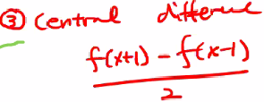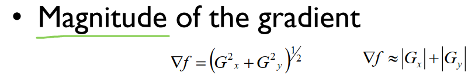


### **📖levelset_update**

* levelset_update에서 gradient를 계산하는 함수를 만들었습니다. 위와 같은 central diff.를 구현하는 gra 함수입니다.

  ```matlab
  function [grax, gray] = gra(input)
  [rows,cols] = size(input);
  grax = zeros(rows, cols);   % gradient of x
  gray = zeros(rows, cols);   % gradient of y
  temp = zeros(rows+2, cols+2);
  temp(2:rows+1, 2:cols+1) = input;
  
  % central diff
  for i = 2:rows+1
      for j = 2:cols+1
          grax(i-1, j-1) = (temp(i, j+1) - temp(i, j-1)) / 2;
      end
  end
  
  for i = 2:rows+1
      for j = 2:cols+1
          gray(i-1, j-1) = (temp(i+1, j) - temp(i-1, j)) / 2;
      end
  end
  
  end
  ```

  

* dt가 0.8으로 설정하면 그림은 niter이 300이 될 때부터 더이상 변하지 않아서 0.6으로 설정했습니다. 0.8으로 해야하면 8줄을 빼시면 됩니다.

* gra()함수를 이용해 dPhi의 gradient를 얻어서 magnitude를 계산하고(10 - 11 줄) gradient를 자기 magnitude를 나눕니다(14 -15줄).

  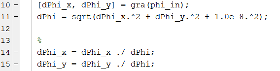

    

* 아래는 divergence 공식입니다

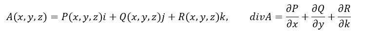

* gradient_x가 P으로, gradient_y가 Q으로 간주하면 divergence의 값은 아래 코드로 구할 수 있습니다(17~20줄).

  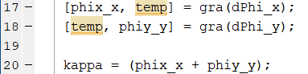

  

##### 수업에서 kappa는 second order derivative라고 했는데 이 부분 코드또 짰습니다. 다만 저는 첫번째 방법으로 실행하는 코드의 boundary가 더 명확하다고 생각해서 첫번째 방법을 사용했습니다.

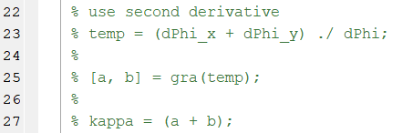