# 📕 Implement frequency domain filters using Matlab

함수와 기능은 아래와 같습니다. 각 함수 자세한 설명은 PDF 파일을 참고할 수 있음

* myLPF.m : Low-pass Filter  
* myHBF.m : High-boost Filter  
* myNotch.m: Notch filter  

### 실행법

Repository를 Clone해서 각 함수 파일을 Matlab로 실행하면 됨.

### 📖 **myLPF**

* 아래는 Butterworth LPF를 구현한 코드입니다.

```matlab
% Creating Frequency filter and apply - High pass filter
%
p2 = floor(dimX);     % P/2
q2 = floor(dimY);     % Q/2
D0 = 100;              % cutoff freq.
tn = 2; tn = 2 * tn;  % two n, 2n

for u=1:PQ(1)
    for v=1:PQ(2)
        D = sqrt((u-p2)^2 + (v-q2)^2);  % D(u, v)
        H = 1 / (1+(D/D0)^tn);          % H(u, v)
        F(u, v) = H * F(u, v);
    end
end
```


* Butterworth filter Formula

  <div  align="center"><kbd>    
      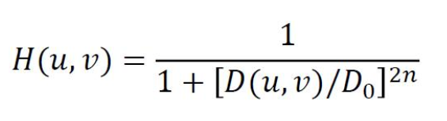
  </kbd></div><br>

* D0이 15이고 n은 2일 때 나오는 그림은 아래와 같습니다.

<div  align="center"><kbd>    
    
</kbd></div><br>


* D0의 값을 100으로 바꿔서 그림이 두렷하게 되었습니다. Cut되지 않은 내용이 많아지기 때문입니다다.

<div  align="center"><kbd>    
    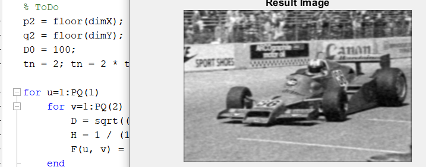
</kbd></div><br>


* 아래 그림 중 위에 있는 두 그림은 D0이 50이고 n 값이 1(왼쪽), 20(오른쪽)인 그림이며, 밑에는 Ideal LPF를 사용해서 나오는 그림입니다. n이 작을 수록 loss된 data가 많으며, 클 수록 Ideal LPF와 비슷합니다(직사각형).

<div  align="center"><kbd>    
    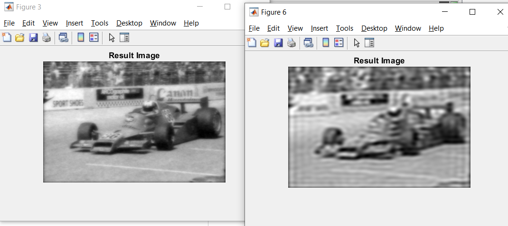
</kbd></div><br>

<div  align="center"><kbd>    
    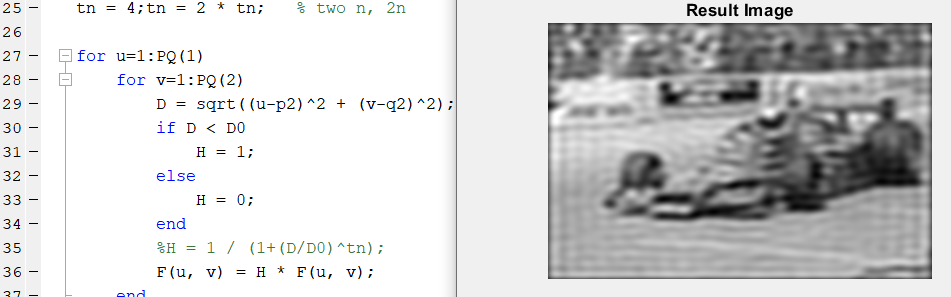
</kbd></div><br>


### 📖 **myHBF**

```matlab
% Creating Frequency filter and apply - High pass filter
%
p2 = floor(dimX);     % P/2
q2 = floor(dimY);     % Q/2
D0 = 200;             % cutoff freq.
tn = 2; tn = 2 * tn;  % two n, 2n
k = 50;               % boosting weight

for u=1:PQ(1)
    for v=1:PQ(2)
        D = sqrt((u-p2)^2 + (v-q2)^2);  % D(u, v)
        H = 1 / (1+(D/D0)^tn);          % H(u, v)
        Hhp = 1 - H;                    % Highpass Filters
        F(u, v) = (1+k*Hhp) * F(u, v);
        %F(u, v) = Hhp*F(u, v);
    end
end
```

* High-boost Filter  Formula

<div  align="center"><kbd>    
    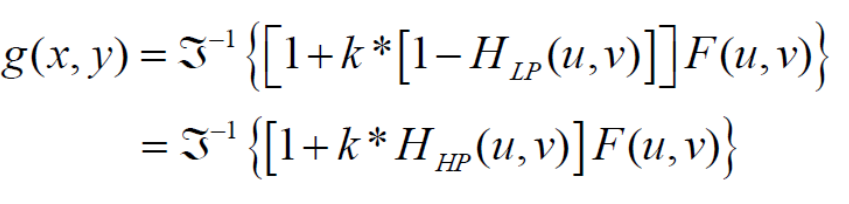
</kbd></div><br>

* D0이 70이고 n은 2인 Butterworth LPF를 사용해서 Highpass Filters를 구합니다. 아래 그림은 k가 10으로 조정되었을 때 나오는 그림입니다. 

  <div  align="center"><kbd>    
      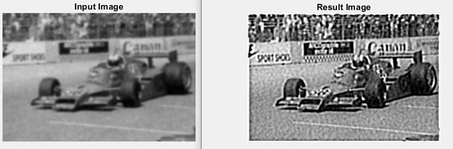
  </kbd></div><br>

* k가 1로 조정되면 나온 결과는 다음과 같습니다. 

<div  align="center"><kbd>    
    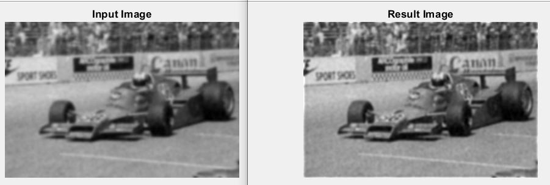
</kbd></div><br>


* k가 클 수록 F(u, v)에 더하는 숫자가 커지고 효과가 분명하게 나오는 반면, k가 작을 수록 input의 차이가 작습니다. 

<div  align="center"><kbd>    
    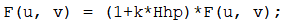
</kbd></div><br>


* D0 값이 200으로, k가 50으로 조정되면 나오는 그림은 다음과 같습니다. D0 값이 크기 때문에 높은 frequence만(예: edge) 사용하며 k가 크기 때문에 효과가 많이 강화될 것입니다. 그래서 결과그림이 input그림보다 많이 두렷하게 나왔다. Edge가 더 명확해졌기 때문입니다.

<div  align="center"><kbd>    
    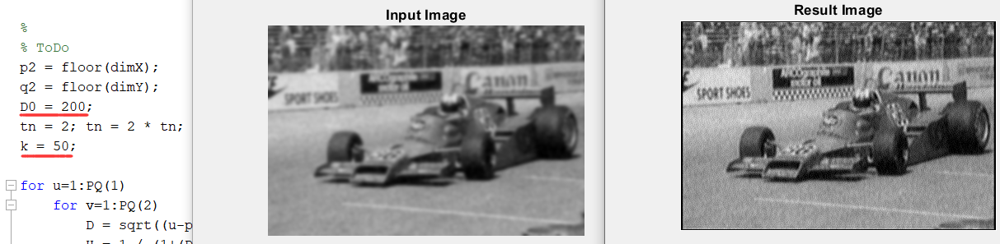
</kbd></div><br>


### 📖**myNotch**

```matlab
% Creating Frequency filter and apply - High pass filter
%
p2 = floor(dimX);     % P/2
q2 = floor(dimY);     % Q/2
D0k = [45, 45, 30, 30, 30, 30, 30, 30, 30, 30, 30, 30, 30, 30, 30];              % cutoff freq.
tn = 6; tn = 2 * tn;  % two n, 2n

% Coordinates of each notch
uk = [213, -213, 259, 0, 258, -258, 45, -45, 213, -213, 213, -213, 303, -303, 167];
vk = [319, 319, 0, 386, 386, 386, 318, 318, 68, 68, 454, 454, 319, 319, 0];
len = size(uk, 2);

for u=1:PQ(1)
    for v=1:PQ(2)
        for i=1:len
            Dk = sqrt((u-p2-uk(i))^2 + (v-q2-vk(i))^2);  % Dk(u, v)
            Dnk = sqrt((u-p2+uk(i))^2 + (v-q2+vk(i))^2);  % D-k(u, v)
            Hk = 1 / (1+(D0k(i)/Dk)^tn);          % Hk(u, v)
            Hnk = 1 / (1+(D0k(i)/Dnk)^tn);          % H-k(u, v)
            Hnr = Hk*Hnk;                    % Highpass Filters
            F(u, v) = Hnr*F(u, v);
            %F(u, v) = 1*F(u, v);
        end
        
    end
end
```

* Notch filter Formula

<div  align="center"><kbd>    
    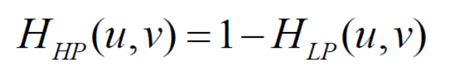
</kbd></div><br>

* Notch의 위치가 uk와 vk에 저장되어 있고 각 notch의 D0또 D0k에 저장되어 있습니다. 위의 코드를 실행하면 나오는 그림은 아래와 같습니다.

<div  align="center"><kbd>    
    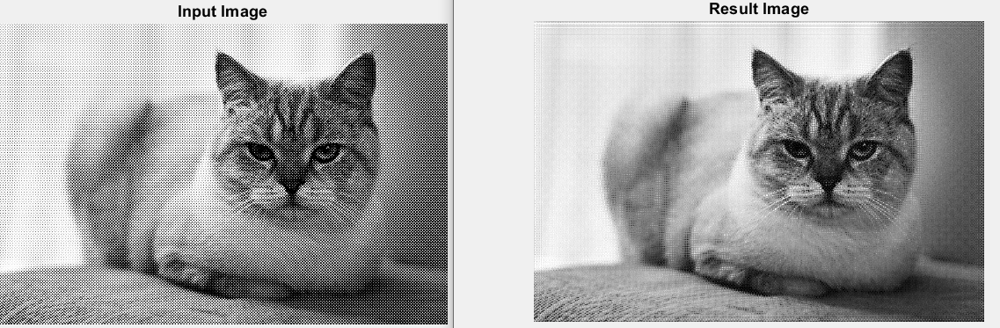
</kbd></div><br>


* 그리고 아래는 Input 그림과 result 그림의 Fourier spectrum(스펙트럼?)입니다.

<div  align="center"><kbd>    
    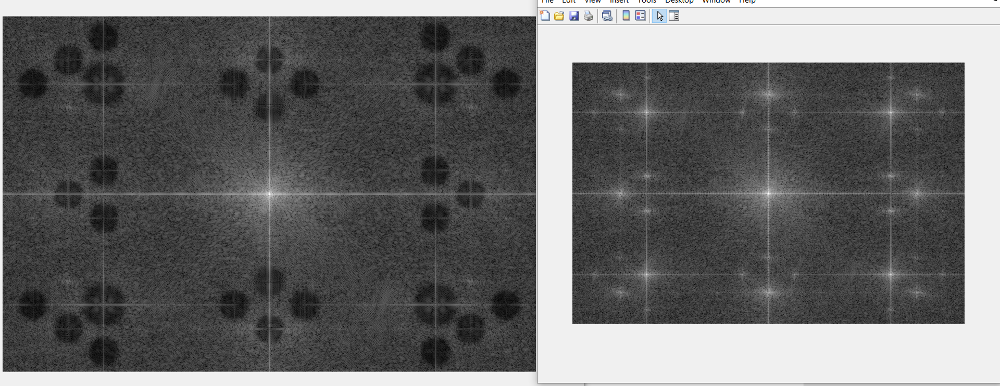
</kbd></div><br>